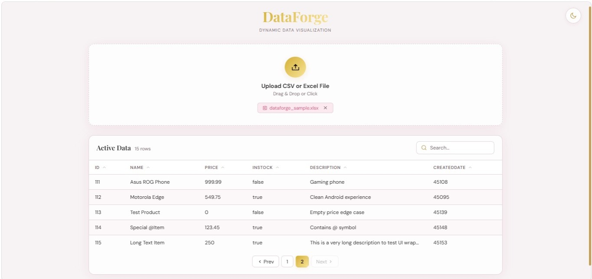
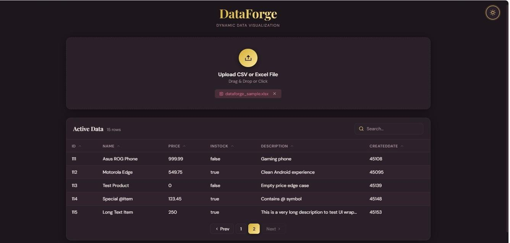

# DataForge
## Preview

### Light Mode


### Dark Mode


## Problem

Analyzing tabular data from CSV and Excel files typically requires either dedicated software or manually writing query scripts. There is no lightweight, browser-based tool that lets you upload a file and immediately paginate, search, and sort its contents without any local setup.

## Solution

DataForge is a full-stack data visualization system that accepts CSV and Excel uploads, stores each row as structured JSON in a SQL Server database, and returns paginated, searchable, and sortable results through a REST API consumed by a React frontend.

## How It Works

1. **Input:** User uploads a `.csv`, `.xlsx`, or `.xls` file via drag-and-drop or file picker in the browser.
2. **Processing:**
   - `xlsx` parses the file on the client into a JSON row array.
   - Rows are sent via POST to the Express backend with a unique `uploadId`.
   - Each row is stored as a JSON string in the `dataforge_rows` SQL Server table under that `uploadId`.
   - On fetch, the backend applies `LIKE`-based search filtering, `JSON_VALUE`-based column sorting, and `OFFSET/FETCH` SQL pagination.
3. **Output:** Paginated table rendered in the browser with column-level sort toggles, live search, and row count — all backed by server-side queries.

## Features

- File upload with drag-and-drop support for `.csv`, `.xlsx`, `.xls`
- Server-side pagination with configurable page size
- Column-level ascending/descending sort via `JSON_VALUE` on stored JSON rows
- Full-text search across raw JSON row data using SQL `LIKE`
- Upload state isolation via `uploadId` — re-uploading the same ID purges previous data
- Skeleton loader during data fetch
- Light/dark theme toggle with CSS variable switching
- Clear file state without page refresh

## Tech Stack

**Frontend:** React 19, Vite, Axios, react-hot-toast, react-icons, xlsx  
**Backend:** Node.js, Express, mssql (tedious driver)  
**Database:** Microsoft SQL Server  
**Utilities:** dotenv, cors, nodemon

## Output

A paginated HTML table rendering all columns from the uploaded file, with server-confirmed row count, per-column sort state, and filtered results matching the search term.

## Setup

```bash
# Clone the repo
git clone https://github.com/RemyAthisayaa17/data-dashboard.git

# Backend setup
cd backend
npm install

# Fill in DB_USER, DB_PASSWORD, DB_SERVER, DB_NAME in .env
npm run dev

# Frontend setup
cd ../frontend
npm install
npm run dev
```

**.env structure (backend):**
```
DB_USER=your_db_user
DB_PASSWORD=your_db_password
DB_SERVER=your_sql_server_host
DB_NAME=your_database_name
PORT=5000
```

The `dataforge_rows` table is created automatically on first upload if it does not exist.

## Future Improvements

- Column-type detection for numeric range filters and date-based sorting
- Export filtered/sorted results back to CSV from the frontend
- Multi-sheet Excel support — currently only the first sheet is processed
- Chunked upload for files exceeding the 50MB Express body limit
- Persistent upload history keyed by session or user ID
